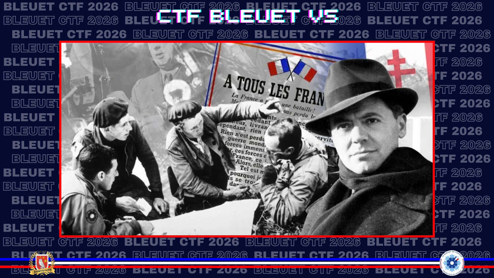
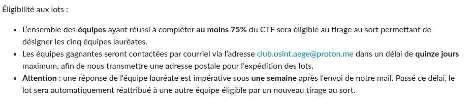

# Bienvenue

> Il y a quelques semaines, en triant les affaires de votre grand-père récemment disparu, vous avez fait une découverte inattendue : dissimulée sous les lattes du parquet, une vieille valise usée par le temps. À l'intérieur s'y cache un véritable trésor clandestin mêlant documents jaunis, photographies d'époque et notes cryptiques bien plus récentes dont le sens vous échappe encore.
>
> Vous saviez qu'il vouait une admiration sans borne aux résistants qui, alors qu'il n'était qu'un enfant, se sont levés pour sauver la France. Mais vous ignoriez l'ampleur de ses investigations. Cette valise et les quatre dossiers qu'elle renferme sont l'œuvre de toute sa vie.
>
> Chaque dossier met en lumière des héros de l'ombre, des actes de bravoure insoupçonnés ou des thématiques qui l'ont profondément marqué. Aujourd'hui, c'est à vous de reprendre le flambeau. Reconstituez le puzzle de ses recherches et poursuivez l'inlassable travail de mémoire et d'archivage qu'il a bâti en secret.

Afin d'avoir accès aux différents documents, il fallait lire le règlement du CTF et retrouver sous combien de jours les vainqueurs tirés au sort seraient contactés.

**Format du flag** : `nombre_jours`

---

Extrait des règles :

✅ **Réponse :** `15_jours`