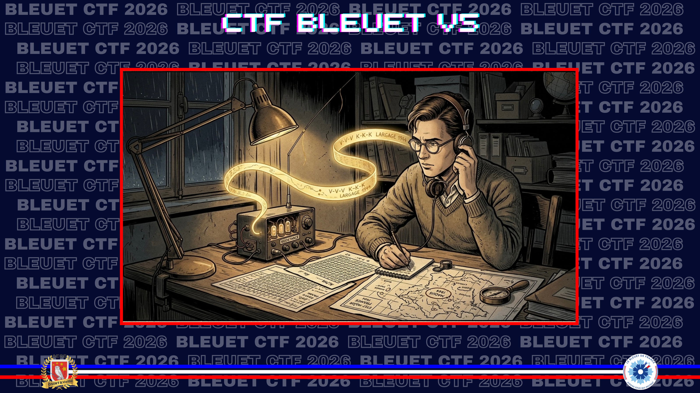
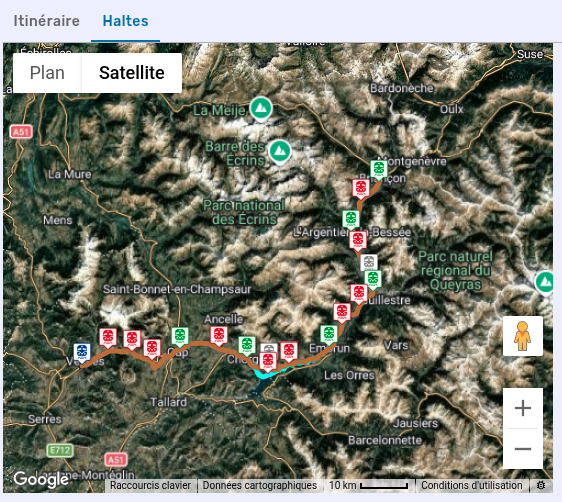
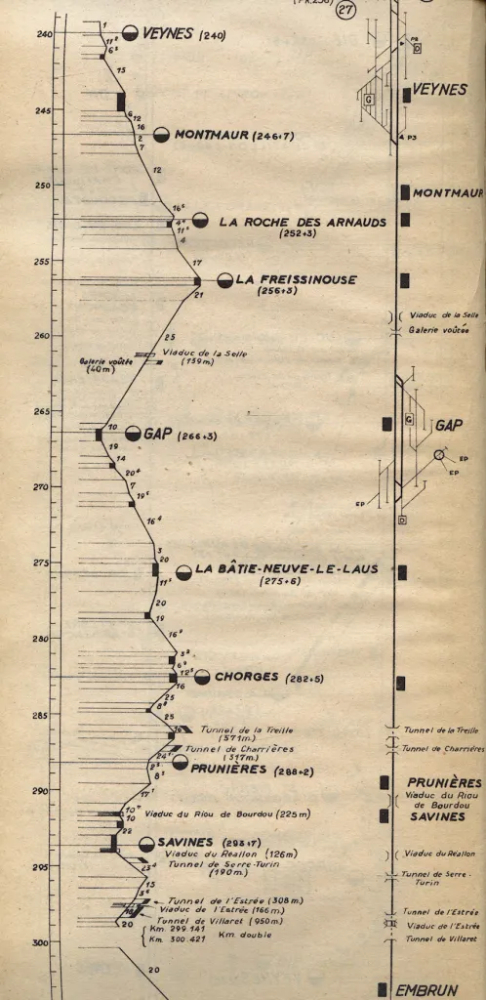
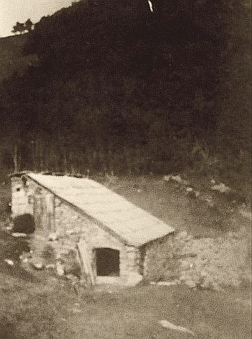

# Alpha ici Bravo

> Votre grand-père adorait se mettre dans la peau de résistants. Il est parvenu à obtenir l'[archive audio](https://bleuet.aege.fr/files/f0a4740d14f2b11c4914dd46b14b2025/CTF_Bleuet_2K26_-_Alpha_ici_Bravo_-_audio.wav) d'un enregistrement radio intercepté en 1944. Il avait noté que cet enregistrement semblait provenir d’un maquis de la résistance capté accidentellement lors d’une transmission clandestine. Un largage de matériel y était programmé dans les jours suivants la transmission, mais le lieu exact de réception était inconnu.

Votre grand-père s'était donné pour mission de localiser la commune concernée par ce largage à partir des seuls éléments donnés.

**Format de flag** : Nomcommune

[1. Audio](./assets/1-audio.wav)

---

Première étape : isoler les voix du bruit de la locomotive. J'ai utilisé [Lalal.ai](https://www.lalal.ai/) et, bien que le résultat ne soit pas parfait, j'ai pu identifier les noms des gares. Le train est parti de Veynes en direction de Briançon. Depuis la gare d'où le message a été diffusé, la ligne dessert Embrun, L’Argentière-la-Bessée et Prelles (cette dernière est fermée mais seulement depuis 1960, ce qui est cohérent avec le contexte). J'ai donc la ligne correspondante :

> [Veynes-Briançon](https://routes.fandom.com/wiki/Ligne_Veynes_-_Brian%C3%A7on#Haltes)
> 

Je mets la main sur un plan d'époque de la ligne entre Veynes (point de départ) et Embrun (prochain arrêt annoncé). L'enregistrement ayant clairement lieu dans une de ces gares, cela laisse quelques possibilités.

> [Train Consultant](https://trainconsultant.com/2024/08/29/la-transalpine-livron-mont-cenis/)
> 

Pour moi, tout converge vers le **cirque de Morgon**. En plus d'être un site de parachutage réputé, l'un de ses panoramas fait directement écho à une image marquante du CTF Bleuet de France de l'an dernier.

*Grand Morgon, un des lieux de parachutage, non loin de Savines-le-Lac.*

Je mise d'abord sur la commune de **Crots**, à laquelle est rattaché le Grand Morgon, mais c'est un échec.

⛔​​ **Fail :** `Crots`

Pensant qu'il faut se recentrer sur la gare elle-même, j'entame alors un véritable "mitraillage" de réponses : **Savines**, **Savines-le-Lac**, **Prunières**... Rien ne passe. Je réalise que je suis en plein **effet tunnel** : je m'acharne sur une seule idée sans remettre en question mon hypothèse. Je décide donc de poser le challenge pour y revenir à tête reposée.

⛔​​ **Fail :** `Savines`
⛔​​ **Fail :** `Savineslelac`
⛔​​ **Fail :** `Prunieres`

De retour après quelques autres challenges, je reprends mes recherches et découvre quelques mentions de Morgon dans les lieux de parachutage, et du maquis de **Chorges**... Le lieux suivant sur le plan de la ligne de train. J'avoue être un peu hésitant à continuer de m'enfoncer dans mon entêtement, mais je décide finalement de tenter ce nouveau guess... Avec malgré tout la sensation d'être passé à côté de quelque chose.

✅ **Réponse :** `Chorges`

