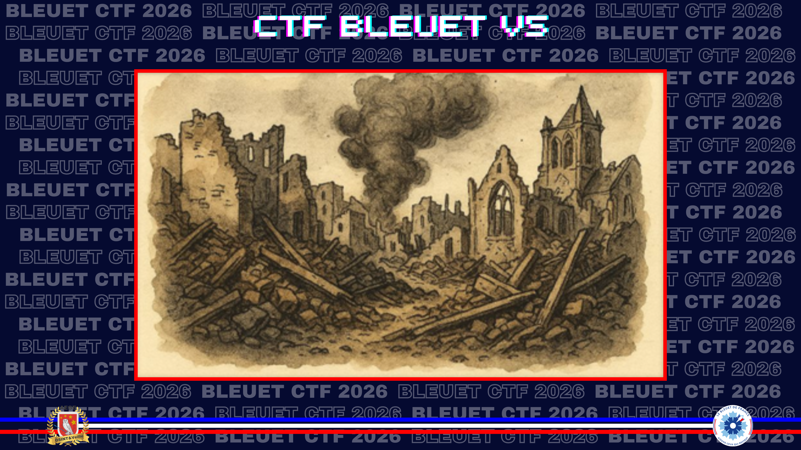
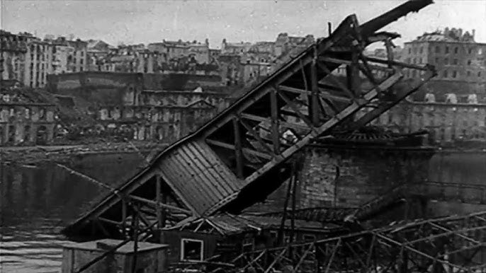
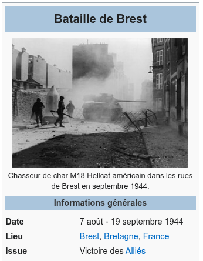

# Décryptage en piqué

> La captation d’image et de son. S’agirait-il d’une preuve irréfutable pour identifier des actions ? Ici, nous voulons reconnaître et retrouver des renseignements en lien avec la libération de l’Europe. Une courte vidéo, manifestement ancienne. Des images de bombardements, un lieu, des dates. À l'époque, votre grand-père du haut de son mètre d'enfant attendait les Alliés. Ces images témoignent de ce qu'il espérait.

Retrouvez le lieu et la date du début de ces faits.

**Format du flag** : `03/05/2024_lyon`  
_Le résultat attendu est sans accent et en minuscule. La date est au format JJ/MM/AAAA._

[Vidéo fournie](./assets/2-video.mp4)

---

Une information utile apparaît en fin de vidéo : la séquence provient de l'ECPAD. Une première recherche sur leur site ne donne rien directement. Je cherche donc une image distinctive à extraire de la vidéo, puis je pars de la prise de vue du pont démoli.

**Source :** [YouTube](https://www.youtube.com/watch?v=XnZq98Mx4E0)

*Bombardement de Brest pendant la Seconde Guerre mondiale.*

Cette piste permet d’identifier le **pont National**, ancien pont tournant métallique de Brest. L’ensemble converge donc vers **Brest**, pendant les bombardements alliés de **1944**.

Reste à compléter la date. La page consacrée à la bataille de Brest donne le début du siège.

**Source :** [Wikipedia — Bataille de Brest](https://fr.wikipedia.org/wiki/Bataille_de_Brest_(1944))

✅ **Réponse :** `07/08/1944_brest`
