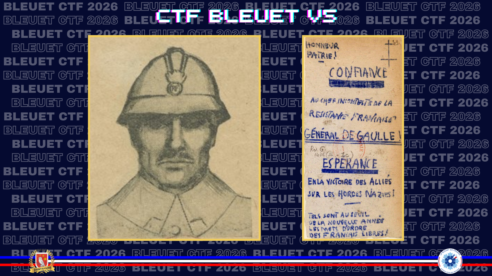
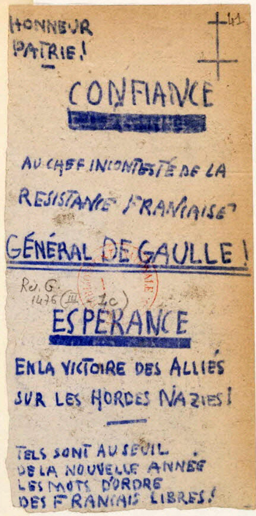
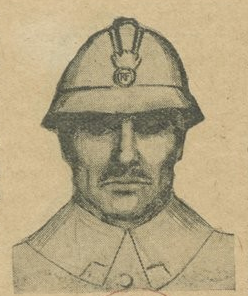
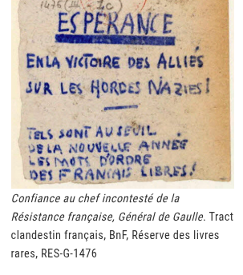
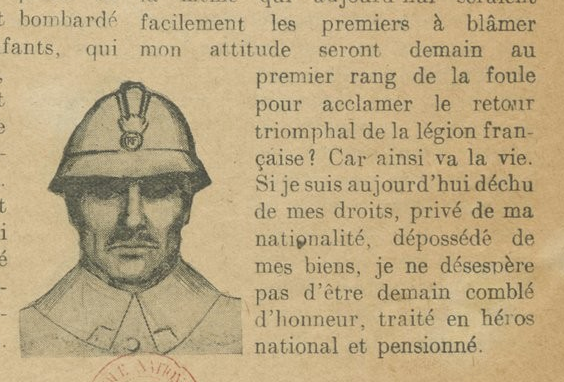

# Lettre d’un soldat

> Il y a 80 ans, le maréchal Pétain venait de signer l’armistice avec l’Allemagne nazie, le général de Gaulle lançait depuis la radio de Londres son appel à la résistance et à la poursuite du combat contre l’ennemi. Parmi les premiers documents de la valise de votre grand-père figurent un tract clandestin froissé et le portrait au fusain d'un soldat. Ce portrait illustre une lettre.

Retrouvez la dernière phrase de cette lettre.

**Format du flag** : `Il nous appartient de veiller tous ensemble à ce que notre société reste une société dont nous soyons fiers.`  
*Le résultat attendu est une phrase ponctuée, avec accents et majuscule.*

---

La recherche du portrait ne donne rien. En revanche, le tract manuscrit mène à une page de la BnF consacrée aux manuscrits du général de Gaulle.

**Source :** [BnF — Les manuscrits du général de Gaulle](https://www.bnf.fr/fr/les-manuscrits-du-general-de-gaulle-naf-28590)

> *Sur Gallica peuvent être consultés plusieurs documents en lien avec l’Appel du 18 juin 1940 et la Résistance française, dont des tracts de la Résistance française.*

Je consulte alors les [tracts de la Résistance française](https://gallica.bnf.fr/ark:/12148/bpt6k990554s/f33.planchecontact). Le premier document de la liste est une lettre illustrée du même portrait de soldat.

✅ **Réponse :** `Si je suis aujourd'hui déchu de mes droits, privé de ma nationalité, dépossédé de mes biens, je ne désespère pas d'être demain comblé d'honneur, traité en héros national et pensionné.`