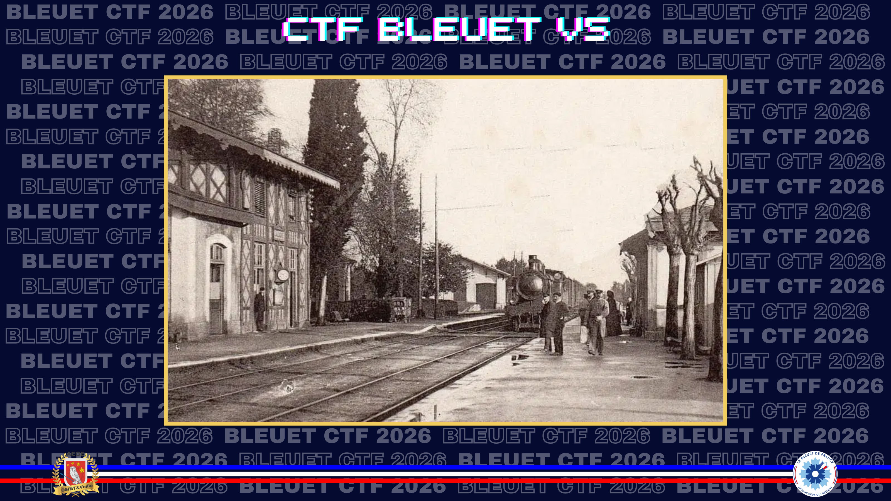
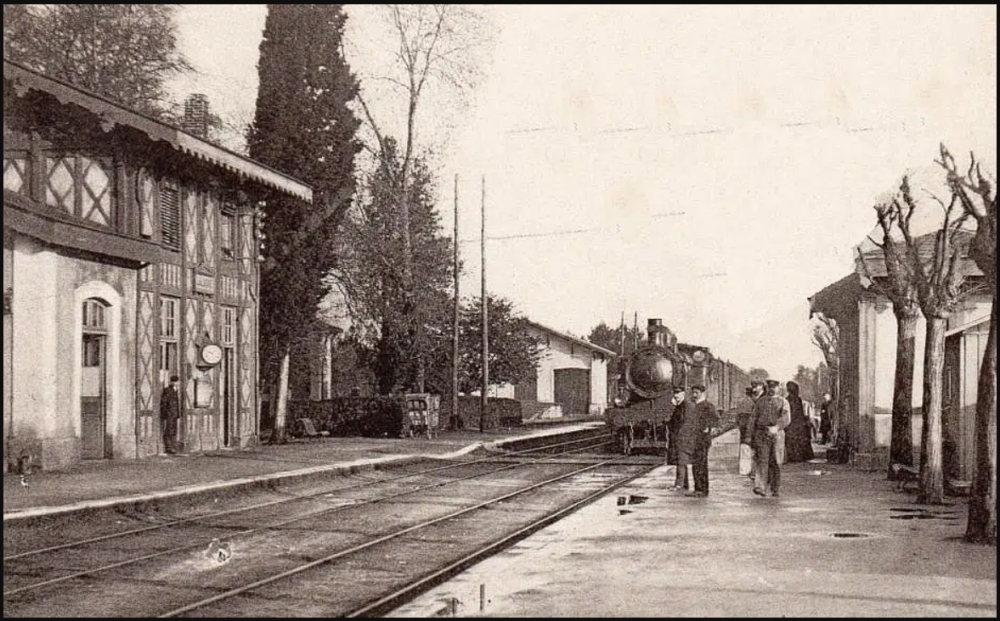
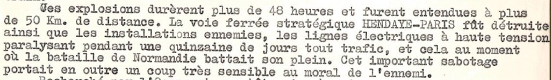

# Plastique et crayons

> Parmi les images conservées par votre grand-père figure cet endroit. Après quelques recherches, vous vous apercevez qu'ici s’est joué l'un des sabotages ferroviaires les plus efficaces de la résistance française. L’auteur des faits a agi en plein jour, alors même que les sentinelles allemandes patrouillaient dans les alentours. Par ailleurs, un document titré de son nom relate encore son exploit.

D’après ce dernier, combien de temps ont duré les explosions et à quelle distance ont-elles pu être entendues ?

**Format du flag** : `moins_de_15h_plus_de_37km`

---

Une recherche d'image inversée permet de retrouver cette carte postale comme illustration de l’article consacré à la **gare de Laluque**.

**Source :** [Wikipedia — Gare de Laluque](https://fr.wikipedia.org/wiki/Gare_de_Laluque)

> *Le 27 juillet 1944, **Henri Ferrand**, membre du groupe de résistance **L'Armée secrète de Pontonx**, réalise le sabotage d’un train de munitions allemand en gare de Laluque.*

Le nom d’Henri Ferrand produit plusieurs homonymes, mais les archives des Landes permettent de retrouver le bon dossier.

**Source :** [Archives des Landes — Henri Ferrand](https://archives.landes.fr/service-educatif/concours-national-de-la-resistance-et-de-la-deportation/cnrd-2022-2023/les-documents/theme-4--enseignants-et-eleves-resistants/henri-ferrand#visionneuse-cms_3942694_0)

✅ **Réponse :** `plus_de_48h_plus_de_50km`