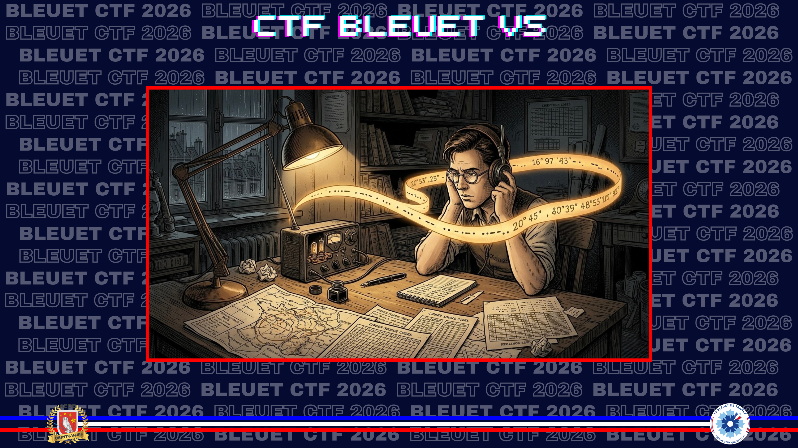
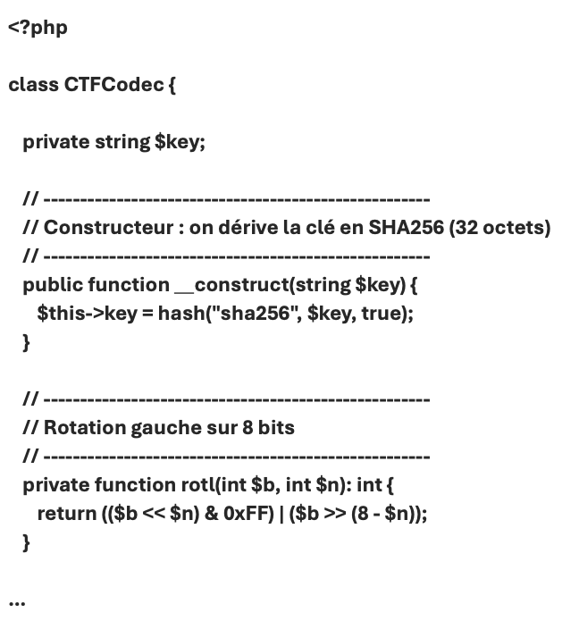

# Interception de code

> Dans les nombreux documents laissés dans la valise de votre grand-père, certains sont beaucoup plus récents. Il semblerait qu'un ami de votre grand-père, lui aussi passionné par le courage des résistants, a laissé un message chiffré à l’aide d’un algorithme baptisé CTFCodec. Vous avez en votre possession le code source de l’algorithme ainsi qu’un message chiffré.

On sait que la clé a été communiquée par un certain Philippe Kieffer. Retrouvez-la.

> Cet algorithme de chiffrement vous permettra de retrouver des informations complémentaires.  
> Le message chiffré dont vous disposez est le suivant : **59.YclN9cRcazVHWkbj3YRjHGIvALPBJCTU**

Où est-ce que cela vous mène ?

**Format du flag** : `plage_du_petit_sperone`  
*Le résultat attendu est sans accents, en minuscules.*

---

> **Statut : non résolu pendant le CTF.**  
> Notes conservées pour documenter le point de blocage et garder une trace du matériel fourni.

Le challenge demandait de retrouver une clé attribuée à **Philippe Kieffer**, puis d’utiliser le code source fourni pour exploiter le message chiffré. Je n’ai pas abouti à une validation pendant le temps du CTF.
