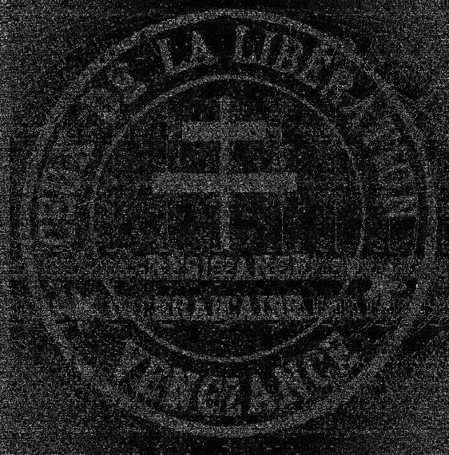
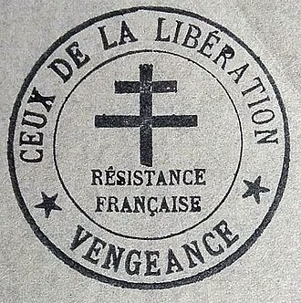

## Motif aléatoire

### 75

> Une [image](https://bleuet.aege.fr/files/7e36f21d21d70a4a8ced1b5be81043ba/CTF_Bleuet_2K26_-_Motif_aleatoire_-_bis.png) qui ressemble à du bruit aléatoire... Cependant, votre grand-père ne gardait rien sans raison. Ce qui semble chaotique cache toujours un ordre...

À vous de le trouver.

**Format du flag** : nom_du_reseau_de_resistance

---

Il s'agit clairement d'un stéréogramme. Je n'ai jamais été très doué pour les "lire", mais heureusement, je connais un bon [outils](https://piellardj.github.io/stereogram-solver/) pour ça.

Le logo du CDLL est assez reconnaissable, d'autant que je l'ai déjà croisé lors d'un autre challenge :

> [!CDLL] [Wikipedia](https://fr.wikipedia.org/wiki/Ceux_de_la_Lib%C3%A9ration)
> 

✅ **Réponse :** `ceux_de_la_libération`

