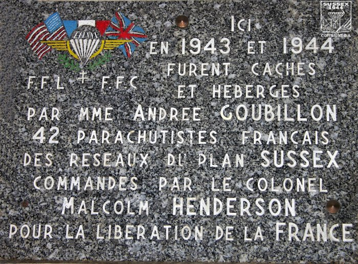

# Le repere

**Latitude** : 48.844001  **Longitude** : 2.34805 

> Des coordonnées précises, notées à la main ? Peut être un point de rendez-vous utilisé par des agents de la Résistance française lors d’une mission de préparation et notamment d’appui ? Il n'était pas rare que pour se reconnaître, les agents utilisent une phrase codée ainsi qu’une photographie. 

À partir de ces éléments, retrouvez le surnom de la personne figurant sur la photographie qui servait de code aux agents pour se reconnaître.

**Format du flag**  : Le_Lynx

---

En utilisant les coordonnées GPS, j'arrive sur une plaque commémorative dédiée à **Andrée Goubillon** au 8 rue Tournefort (Paris). 

Une recherche sur cette plaque et ce nom me conduit à un nom : "**Plan Sussex**".

> [!Plan Sussex] [Wikipedia](https://fr.wikipedia.org/wiki/Plan_Sussex)
> Madame **Andrée Goubillon**, qui habitait au no 8 rue Tournefort à Paris, cacha et hébergea 42 parachutistes français des réseaux du plan Sussex, commandés par le colonel Malcolm Henderson pour la libération de la France entre 1943 et 1944.

Je trouve ensuite un site consacré au Plan Sussex. L'une de leur mission "**Pathfinder**" impliquait que les personnes se rendant à l'adresse en **question** (un café tenu par Madame Andrée), se faisaient reconnaître avec une phrase codée : "Bonjour ma tante, comment va mon oncle ?" et en présentant une photo.

> [!Pathfinder] [Plan Sussex 1943-1944 - Mission Pathfinder](https://www.plan-sussex-1944.net/fr/missions/mission_pathfinder.htm)
> C’est ainsi que commença le travail dangereux et difficile qui consistait à héberger et cacher certaines équipes Sussex. **Madame Goubillon** se souvient que pour se présenter, les agents qui entraient la première fois dans son café devaient dire : « **Bonjour ma tante, comment va mon oncle ?** » Ils montraient en même temps la **photo d’un bébé**, connu sous le nom de **Mic-Mic**, en fait le dernier fils du colonel Rémy.

✅ **Réponse :** `Mic_Mic`