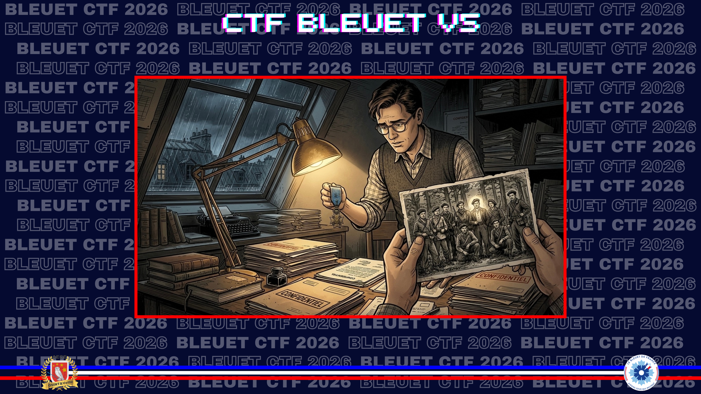
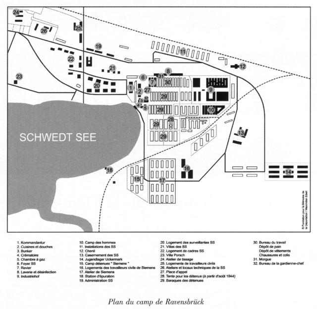
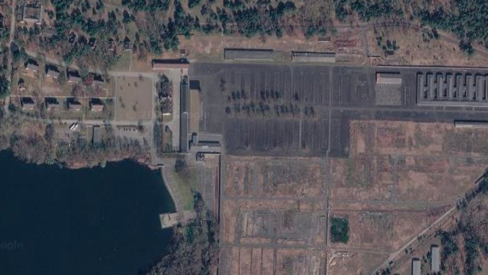

# Plus qu’un numéro

> Votre grand-père avait réussi à obtenir une vraie fiche matricule, un document authentique. Malheureusement, avec le temps, l’encre s’est progressivement effacée et vous ne disposez plus que du numéro de matricule et du lieu de naissance de la résistante : **62863**, **Cognac**. Intéressez-vous à son identité et à son histoire.

Indiquez les coordonnées géographiques de son lieu de décès.

**Format du flag** : `19.11_20.22`

---

Une recherche à partir du matricule permet de l’associer au camp de concentration de **Ravensbrück**. Le numéro correspond à **Marie Henriette Rivière**, née Quérois, résistante née à Saint-Gourson et employée aux PTT à **Cognac**.

**Source :** [Le Maitron — Marie Henriette Rivière](https://maitron.fr/riviere-marie-henriette-dite-paule-nee-querois/)

> *Un convoi partit de Belfort le 1er septembre 1944, des femmes incarcérées à Cottbus furent placées dans ce convoi à destination du camp de concentration de Ravensbrück, elle porta le **matricule 62863**. [...] Très affaiblie par la dysenterie, elle mourut pendant la nuit à l’infirmerie de Ravensbrück le **15 février 1945**.*

Il reste donc à situer l’infirmerie du camp.

**Source :** [Comité International de Ravensbrück](https://www.irk-cir.org/fr/brief_history)

> *L'infirmerie du camp de femmes de Ravensbrück se trouvait à l'endroit au début de la première allée du camp. Elle se composait de deux baraques en forme de H, appelées Revier I. En 1943, plusieurs autres baraques à côté ou en face furent ajoutées comme Revier II réservées aux prisonniers atteints de maladies telles que la tuberculose, la scarlatine, l'angine et la typhoïde.*

**Source :** [Collège Malraux — plan du camp](https://clg-malraux-asnieres.ac-versailles.fr/spip.php?article815)

Sur ce plan, l’infirmerie correspond au numéro 7. Je reporte l’emplacement sur Google Maps pour obtenir les coordonnées : **53.191590, 13.165511**.

✅ **Réponse :** `53.19_13.16`
