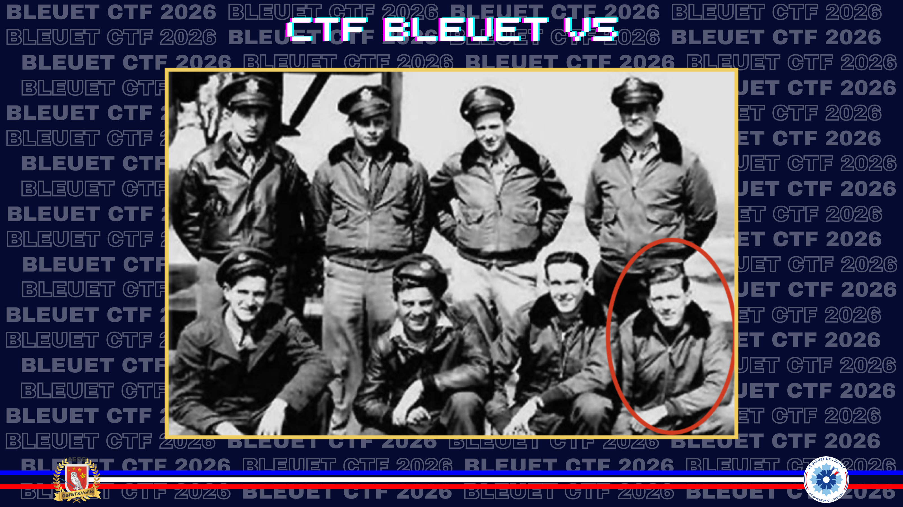
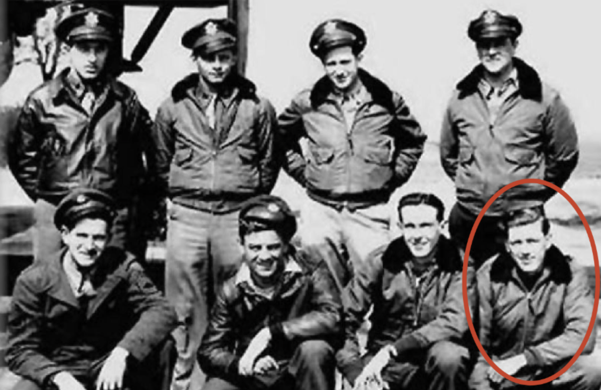

# L'equipage

> Dans la valise, vous trouvez cette photographie d’un équipage d’agents de la Résistance. Votre curiosité vous pousse à trouver l’identité de la personne agenouillée tout à droite sur l’image.

 Comment s’appelle-t-il ?

**Format du flag** :  Nomdefamille

---

Je tente immédiatement une recherche d'image inversée via Google, avec correspondance exacte. Une source trouve, un [fichier PDF](https://www.plan-sussex-1944.net/en/pdf/Stapels_crew.pdf) reprend le détail des huit membres de l'équipage de Wilmer L. Stapel pour l'opération FIAT 6, avec la même photographie :

[2. Stapels crew](./assets/2-stapels-crew.pdf)

✅ **Réponse :** `Goodman`