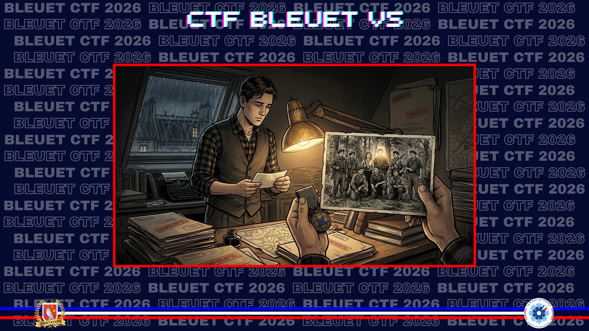
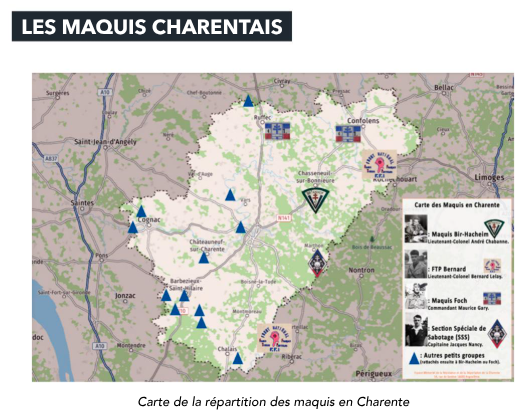
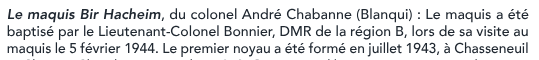
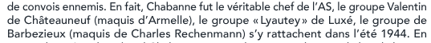

# La Charente libérée

> « Après cette descente du maquis, j'ai craint des représailles et peu après, j'ai rejoint le bois près de Louzac-Saint-André ». Votre grand-père s’était apparemment intéressé à cet homme, mais ne vous a pas laissé son identité.

Qui était le chef de ce réseau de résistance, ainsi que son alias ?

**Format du flag** : `Prénom_Nom_Alias`

---

> **Statut : non résolu pendant le CTF.**  
> Notes conservées pour documenter les pistes explorées et les points de blocage.

En isolant les mots-clés `descente du maquis`, `représailles` et `Saint-André`, je tombe sur le livre d’Alain Léger, **Les Indésirables — L'histoire oubliée des Espagnols en pays charentais**.

**Source :** [Entreprises-coloniales.fr — Les Indésirables](https://www.entreprises-coloniales.fr/empire/Les_Indesirables.pdf), p. 184

Tout jeune marié, **Jesús Lapiedra** se remémore la scène :

> Afin d'éviter les mauvaises rencontres, j'avais prévenu le maquis que les Allemands venaient régulièrement s'approvisionner un jour de la semaine en troquant la marchandise contre de l'essence. Après cette descente du maquis, j'ai craint des représailles et peu après, j'ai rejoint le bois de Saint-André.

Deux pistes ressortent : **Jesús Lapiedra** et le **maquis Dubroca**.

En creusant autour de Dubroca, je trouve le nom d’**Allyre Sirois**, opérateur radio. Une autre source mentionne son futur chef de réseau, **Charles Rechenmann**, alias **Julien**.

**Source :** [ANACR Charente Limousine](https://anacrcharentelimousine-charente.ovh/APetit.htm)

Le 20 janvier, ayant terminé son entraînement, il rentre à Londres. Le 27, il contracte une pneumonie, qui l’amène à être hospitalisé au Masonic Hospital du 30 janvier au 15 février. Pendant cette période, il reçoit la visite de **son futur chef de réseau, Charles Rechenmann**, dont il doit devenir l’opérateur radio.

⛔ **Fail :** `Charles_Rechenmann_Julien`  
⛔ **Fail :** `Charles_Rechenmann_Raymond`

Je poursuis ensuite par Louzac-Saint-André. Une page consacrée à Louzac indique que le **maquis de Saint-André** a été rattaché au **maquis de Bir Hacheim**.

**Source :** [Patrimoine de Cognac — Louzac](https://photocognac.com/a-voir-pres-de-cognac/louzac/)

Durant la Seconde Guerre mondiale, le **maquis de Saint-André** était dans les bois de Saint-André. Il **a été rattaché au maquis de Bir Hacheim**.

La piste Bir Hacheim mène à **André Chabanne**, alias **Blanqui**.

**Source :** [Wikipedia — André Chabanne](https://fr.wikipedia.org/wiki/Andr%C3%A9_Chabanne)

André Chabanne est un résistant, dit **Blanqui**. Il crée le maquis de Bir Hacheim avec Guy Pascaud et Hélène Nebout, puis en prend l’organisation et l’armement.

Je vérifie cette direction avec un document du département de la Charente sur l’Occupation et la Résistance.

**Source :** [Libérer et refonder la France 1943-1945 — Charente](https://www.calameo.com/read/004473386a3afd72f09af), pp. 38-39

La présence de Charles Rechenmann dans ce document renforce l’impression d’être sur une piste cohérente, mais les tentatives ne passent pas.

⛔ **Fail :** `Andre_Chabanne_Blanqui`  
⛔ **Fail :** `André_Chabanne_Blanqui`

Dernier pivot : le remplacement de Rechenmann par **Charles Corbin**, alias **Allyre**, et les liens avec les résistants locaux, dont René Dubroca.

**Source :** [ANACR Charente Limousine](https://anacrcharentelimousine-charente.ovh/APetit.htm)

Le 10 août, le nouveau chef de réseau envoyé de Londres arrive enfin : c’est **Charles Corbin**, pseudo **Allyre**, chef du réseau Allyre-CARVER.

**Source :** [Passirac](https://passirac1heureusenature.jimdofree.com/histoire/au-fil-du-temps/15-avril-1944/)

Avec l'aide des résistants locaux, Tapon, Philippe Mesnard et **René Dubroca**, il contribue à fonder et à armer de petits maquis vers Saint-Laurent. C’est là que vient le rejoindre le remplaçant de Rechenmann, le capitaine Corbin, fin juillet ou début août 1944.

⛔ **Fail :** `Charles_Corbin_Allyre`  
⛔ **Fail :** `Bernard_Fischer_Fernand`
