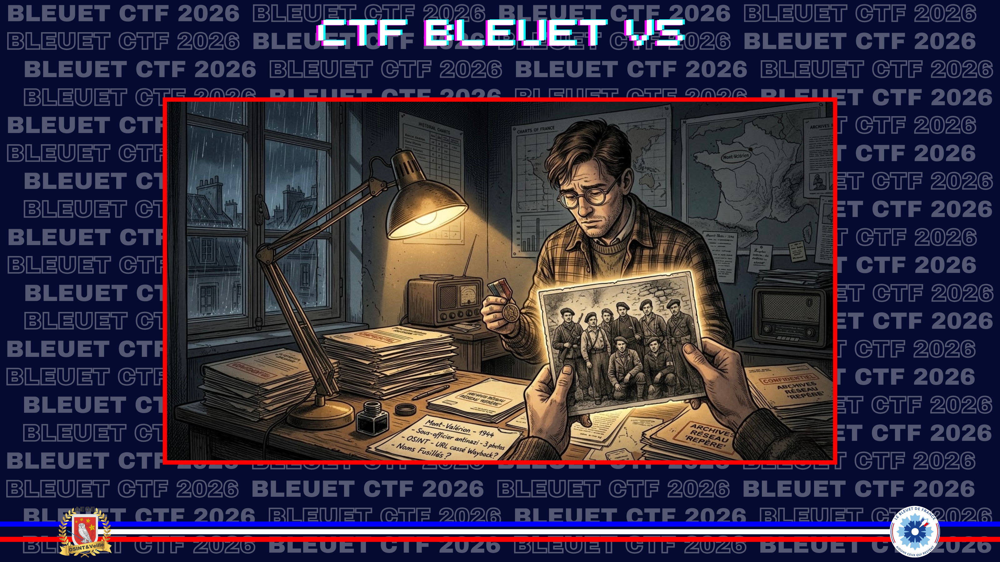
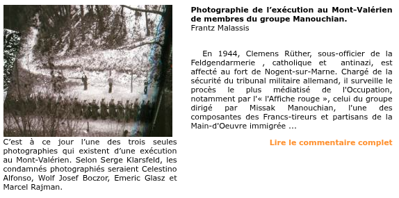
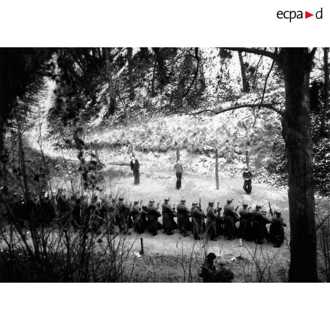

# Les fusillés du Mont-Valérien

> À côté d'autres photos, des notes de votre grand-père s’intéressaient à un sous-officier allemand catholique et antinazi qui, en 1944, parvient clandestinement à prendre trois photographies d’une exécution sur l’un des lieux majeurs de la répression nazie en France. Ces images, longtemps considérées comme de simples reconstitutions, ne seront véritablement authentifiées qu’au début des années 2000.

**Mission :** retrouver le nom des résistants présents sur ces photographies.

Lien fourni : [fondationresistance.org/pages/rech_doc/photo.htm](https://www.fondationresistance.org/pages/rech_doc/photo.htm)

**Format du flag** : `Debuy_Morel_Dupont_Guilleux`  
*Le flag correspond aux quatre noms complets des résistants visibles sur le cliché.*

---

Le lien fourni n’est plus disponible directement. Je passe donc par la Wayback Machine et retrouve rapidement l’article, accompagné de la photographie et du nom des condamnés.

**Source :** [Wayback Machine — Fondation de la Résistance](https://web.archive.org/web/20250414214514/https://www.fondationresistance.org/pages/rech_doc/photo.htm)

Le sous-officier allemand est **Clemens Rüther**. Les résistants ont été identifiés par **Serge Klarsfeld**. Je vérifie ensuite l’information sur la version actuelle du site de la Fondation de la Résistance.

**Source :** [Fondation de la Résistance](https://www.fondationresistance.org/recherche-et-documentation/ressources/photographie/photographie-liinexy-cution-mont-valy-rien-membres-groupe-manouchian-photo15/)

Les condamnés photographiés y sont indiqués comme étant **Celestino Alfonso**, **Wolf Josef Boczor**, **Emeric Glasz** et **Marcel Rajman**.

Le site de l’**ECPAD** donne une variante orthographique : **Joseph Boczow** au lieu de **Boczor**. Je conserve toutefois la version de Serge Klarsfeld, cohérente avec la source précédente et avec le flag attendu.

**Source :** [ECPAD — Exécutions au Mont-Valérien](https://imagesdefense.gouv.fr/fr/executions-de-celestino-alfonso-joseph-boczow-emeric-glasz-et-marcel-rajman-resistants-francs-tireurs-et-partisans-de-la-main-d-oeuvre-immigree-ftp-moi-du-groupe-manouchian-au-mont-valerien-le-21-fevrier-1944.html)

✅ **Réponse :** `Alfonso_Boczor_Glasz_Rajman`
