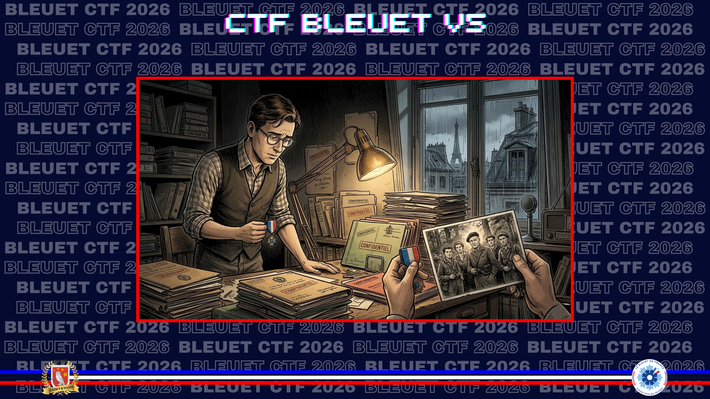
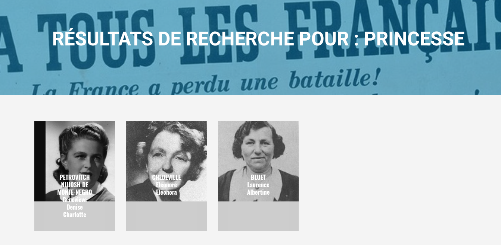
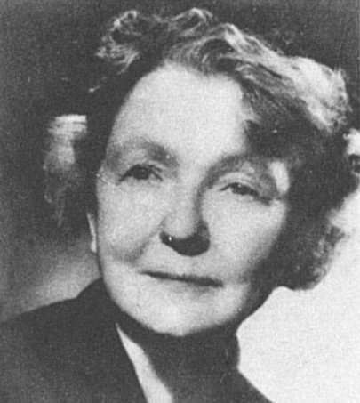

# La princesse

> Dans sa quête aux héros de la Résistance, votre grand-père s’était tout particulièrement intéressé à une résistante connue sous le pseudonyme « La Princesse », qui s’était engagée en avril 1942. Il avait pu discerner qu'elle était d’origine italienne, qu'elle avait exercé des fonctions de radio et d’agent de liaison, mais aussi qu'elle disposait du statut d'agent permanent qui conserve son activité professionnelle. Bien que votre grand-père était tombé sur un certain Gilbert Renaud qui faisait partie du même groupe de résistant, il n'était pas parvenu à retrouver son identité à elle.

Quel est le prénom et le nom d'épouse de « La Princesse » ?

**Format du flag** : Mathilde_Stuart

---

Ma première recherche centrée sur le pseudo m'envoie sur une fausse piste. Une certaine Noor Inayat Khan, résistante mais princesse musulmane indienne, née à Moscou. Mauvais pivot.
Je pars cette fois-ci de Gilbert Renaud, alias "**Colonel Rémy**", avec un fameux CV. Il a notamment été chargé de créer un réseau de renseignements sur le sol français, mais il a également fondé la "**Confrérie Notre-Dame**" qui deviendra "**CND-Castille**", ainsi que le **réseau Centurie**. 

[Wikipedia](https://fr.wikipedia.org/wiki/Colonel_R%C3%A9my)

Il est parmi les premiers à se rallier à la cause du général de Gaulle et se voit confier par le capitaine Dewavrin, futur colonel Passy, alors capitaine et chef du Bureau central de renseignements et d’action (BCRA), la création d'un réseau de renseignements sur le sol français. [...]
Lors de sa première mission, il crée en 1940 la **Confrérie Notre-Dame**, qui deviendra en 1944 **CND-Castille**, en s'appuyant sur l'action de Louis de La Bardonnie [..] ce réseau finit par couvrir la France occupée à partir de 1941 puis la Belgique et devient l'un des plus importants de la zone occupée. [...] Il crée aussi en septembre 1940 le réseau **Centurie**.

Je trouve rapidement un site consacré au CND-Castille, lequel propose un annuaire... 50 personnes référencées par page, 33 pages. Heureusement, ils ont judicieusement prévu un moteur de recherche. "Princesse" propose 3 résultats.

[CND-Castille.org](https://www.cnd-castille.org/annuaire)

Seules Eléonore Chedeville et Laurence Bluet portent vraiment un tel surnom. Mais évidemment, seule l'une est italienne et tout concorde :

**Eléonore Eleonora Ruffo di Calabria** épouse **Chedeville**, née à Naples.
Enregistrée en **avril 1942**, pseudo "**La Princesse**" car héritière d'une famille princière italienne.
**Agent P1** (activité régulière dans un réseau, tout en gardant son métier ou sa couverture civile).

✅ **Réponse :** `Eléonore_Chedeville`