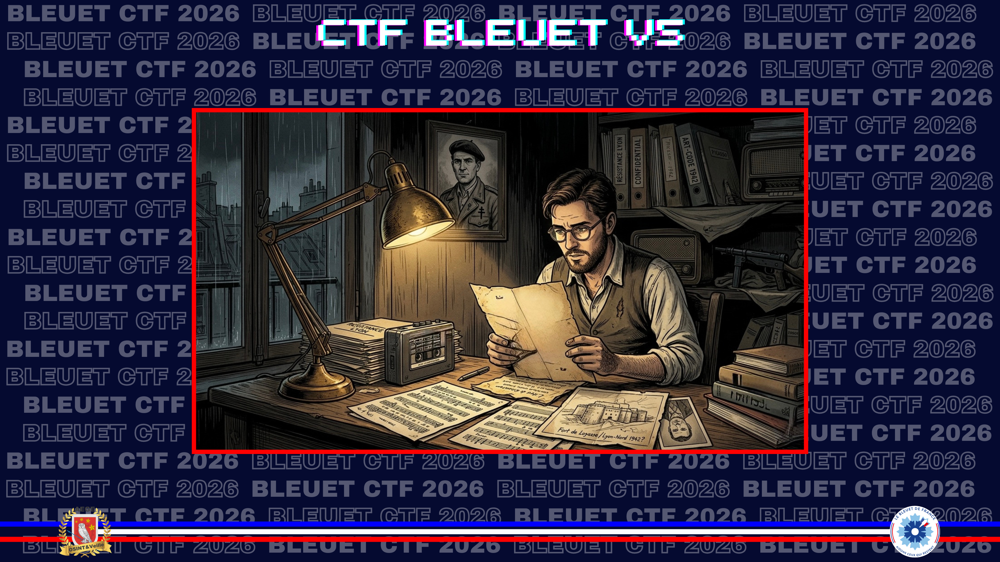
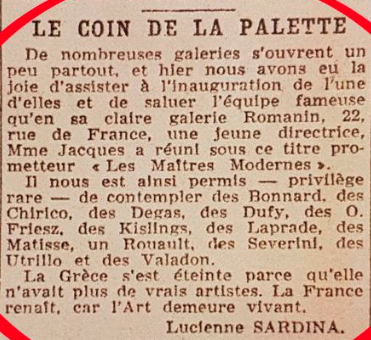
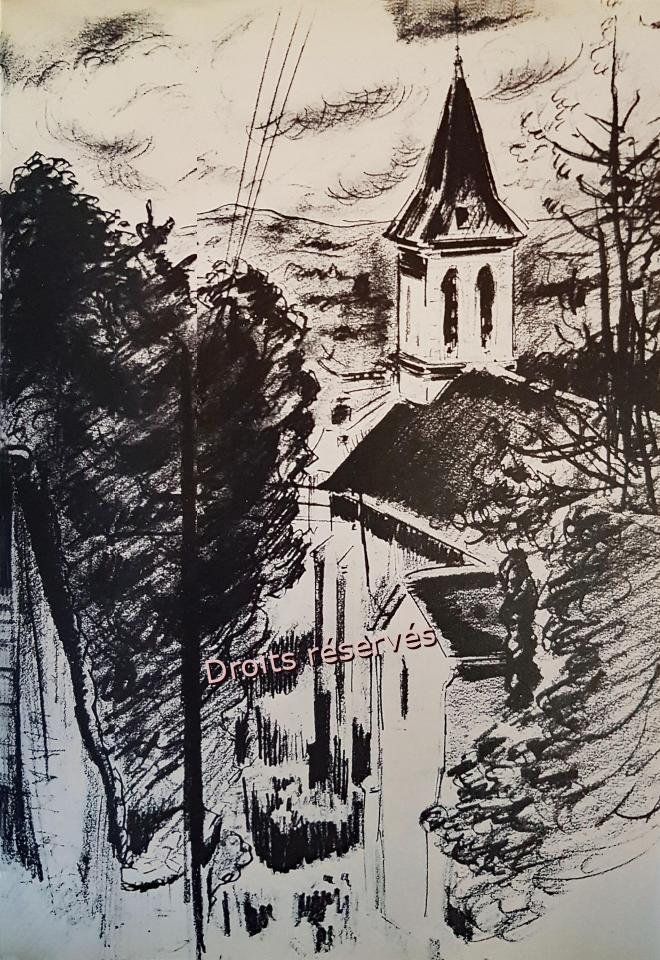

# Resistant dans l'art



> Votre grand-père était un fan inconditionnel de l’Art. La vision de Pablo Picasso résonnait particulièrement en lui, notamment parce qu’il pouvait en faire un parallèle plein de sens avec la Résistance : « La peinture n'est pas faite pour décorer les appartements. C'est un instrument de guerre offensive contre l'ennemi ». En fouillant dans la valise, vous découvrez une photo d’un croquis qui vous intrigue, car il semble représenter un bâtiment au nord de Lyon. En effectuant des recherches sur ce dernier, vous découvrez qu’en 1942, un célèbre résistant, également artiste dans l’âme, ouvre sous son vrai nom une galerie de tableaux modernes. Cette activité légale lui a servi de couverture afin de justifier ses nombreux déplacements dans l’hexagone.

Quel est le nom de la galerie d’art et comment se nomme le bâtiment illustré sur le croquis ?

**Format du flag** : nom de la galerie_nom du bâtiment (le flag est attendu en minuscule et sans accent)

---

Résistant célèbre, passionné d'art, on arrive assez rapidement sur **Jean Moulin** qui, évidemment, a quelques sites qui lui sont consacrés. L'un d'eux est particulièrement complet :

[Jeanmoulin.fr](https://jeanmoulin.fr/GalerieRomanin)

Depuis sa mise en disponibilité, Jean Moulin est officiellement agriculteur à Saint-Andiol. Dès l'été 1942, il a besoin de **justifier de fréquents déplacements dans l'hexagone et cherche à se créer une couverture**. Pour cela, il songe à utiliser ses goûts et compétences artistiques en adoptant la profession de marchand de tableaux obligé de traverser la France pour rencontrer des peintres et des collectionneurs, acheter ou vendre des tableaux. C'est ainsi qu'il ouvre, 22 rue de France à Nice, **sous son vrai nom**, une galerie de tableaux modernes. [...]
Jean Moulin signe une promesse de bail le **12 octobre 1942** et le 16, il sollicite par courrier auprès du préfet des Alpes-Maritimes l'autorisation d'ouvrir une "**galerie d'exposition** et de vente de peintures, dessins et sculptures modernes…".



Si le nom de la galerie est tout trouvé, il m'est un peu moins évident de comprendre de quel bâtiment du Nord de Lyon il est question dans l'énoncé.  Je pense d'abord à la Maison du docteur Dugoujon, lieu où a été arrêté Jean Moulin au Nord de Lyon. Mais pas de traces de croquis. Mais en creusant un peu plus les derniers moments de sa vie libre dans la région lyonnaise, je trouve une phrase qui parle d'un dessin d'une église :

[Jeanmoulin.fr](https://jeanmoulin.fr/DernierCombat)

Du 12 au 14 juin 1943, week-end de pentecôte, Il ne veut pas prendre le risque de rester à **Lyon** où la Gestapo fait des coupes sombres [...] Il s'adonne avec ses hôtes à la chasse aux escargots près de la tour qui surplombe le village, et de Trévoux, remonte à bicyclette vers le **nord** jusqu'**au village de Beauregard dont il dessine l'église**.



✅ **Réponse :** ```galerie romanin_eglise de beauregard```