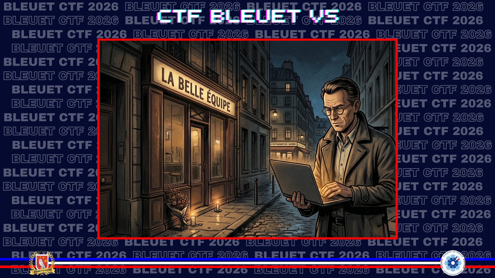
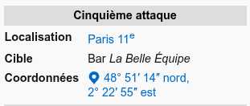
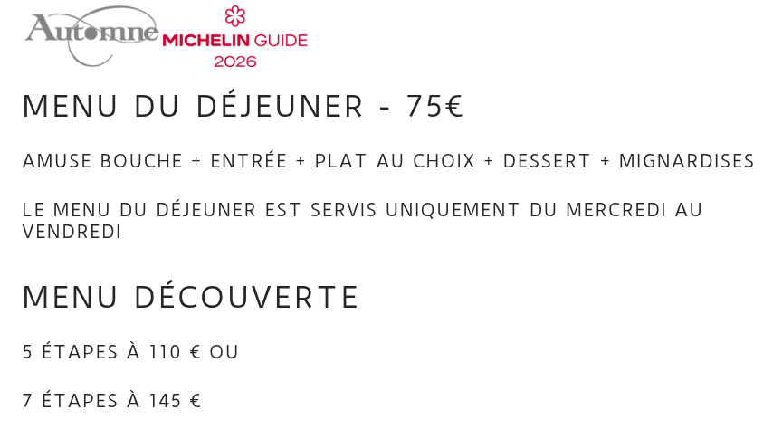

# Une oreille pour se souvenir

> Comme votre grand-père, vous avez à cœur le devoir de mémoire. Cet hiver, pour les 10 ans des attentats du 13 novembre, vous êtes allés rendre hommage aux victimes de cette tuerie devant le bar « La Belle Équipe ». À moins de 150 mètres, vous tombez sur le restaurant dans lequel vous alliez souvent manger avec votre grand-père, non pas parce qu’il appréciait particulièrement le menu, mais parce que son nom d’enseigne, rappelant un moment météorologique de l'année, était un mot cher à son cœur et à la Résistance. Alors, vous entrez, vous vous installez et vous commandez le menu découverte en 5 étapes.

De quel restaurant s'agit-il ?

**Format du flag** : `Nomdurestaurant`

---

Je commence par vérifier l’adresse de **La Belle Équipe**, point de départ géographique du challenge.

**Source :** [Wikipedia — Attentats du 13 novembre 2015 en France](https://fr.wikipedia.org/wiki/Attentats_du_13_novembre_2015_en_France)

La recherche porte ensuite sur les restaurants situés dans un rayon d’environ 150 mètres. L’un d’eux se nomme **Automne**, référence directe au poème de Verlaine utilisé comme code dans le contexte du débarquement de Normandie.

Le site du restaurant confirme l’existence d’un menu découverte en cinq étapes.

**Source :** [Restaurant Automne — menu](https://www.automne-akishige.com/menu/)

✅ **Réponse :** `Automne`