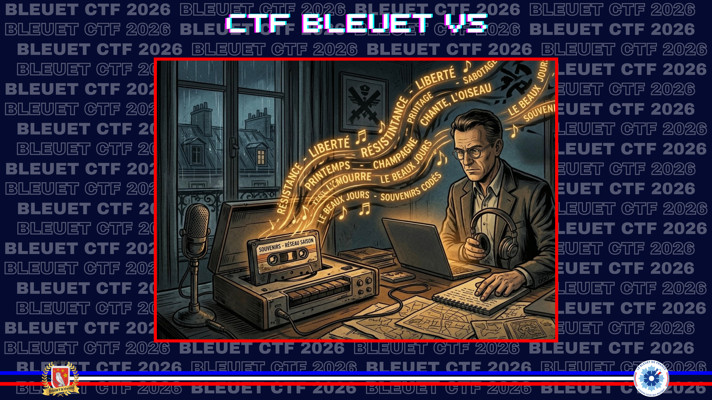
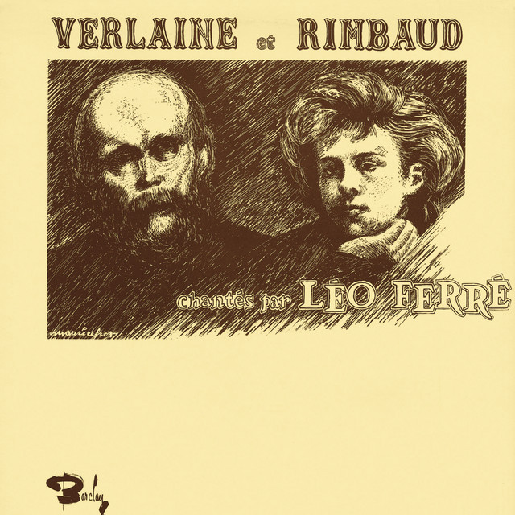

# Des mots pour contrer les maux

> Alors que vous rentrez chez vous, vous vous souvenez que votre grand-père vous avait transmis une cassette en lien avec cette saison. Il vous disait que la musique présente sur cet enregistrement portait le même nom qu'un code utilisé par des résistants de son village. Hélas, le temps a fait son œuvre, et cette cassette ne contient plus qu'une courte bande audio.

À l'aide de cette bande audio, retrouvez le titre de cette musique.

**Format du flag** : `Titre_musique`

[Audio fourni](./assets/3-cassette-abimee.mp3)

---

L’extrait audio est suffisamment exploitable pour être reconnu par Shazam. Les dernières secondes correspondent à **Chanson d’Automne**, interprétée par **Léo Ferré**.

**Outil :** [Shazam](https://www.shazam.com/fr-fr)

✅ **Réponse :** `Chanson_d_automne`