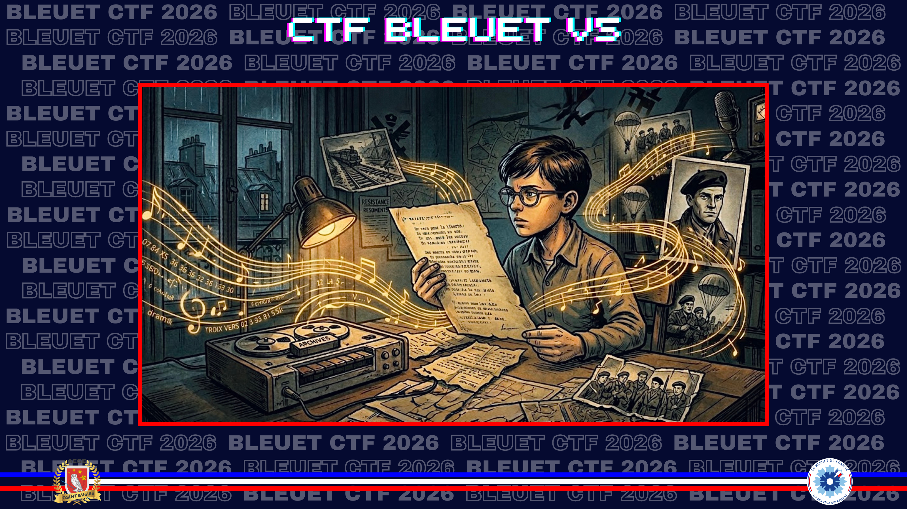

# Un vers pour la liberté

> Votre grand-père appréciait particulièrement la musique de cet enregistrement parce que certains vers symbolisaient un code employé par la Résistance.

De quel réseau de résistants est-il question ?

**Format du flag** : `Nom_réseau`

---

La page consacrée au poème **Chanson d’automne** mentionne son utilisation par Radio Londres en juin 1944. Les vers ne s’adressaient pas indistinctement à tous les réseaux : ils visaient un réseau précis.

**Source :** [Wikipedia — Chanson d’automne](https://fr.wikipedia.org/wiki/Chanson_d%27automne)

Sa première strophe, légèrement altérée, a été utilisée par Radio Londres au début du mois de juin 1944 pour ordonner aux saboteurs ferroviaires du réseau **VENTRILOQUIST** de Philippe de Vomécourt de faire sauter leurs objectifs.

✅ **Réponse :** `Ventriloquist`
