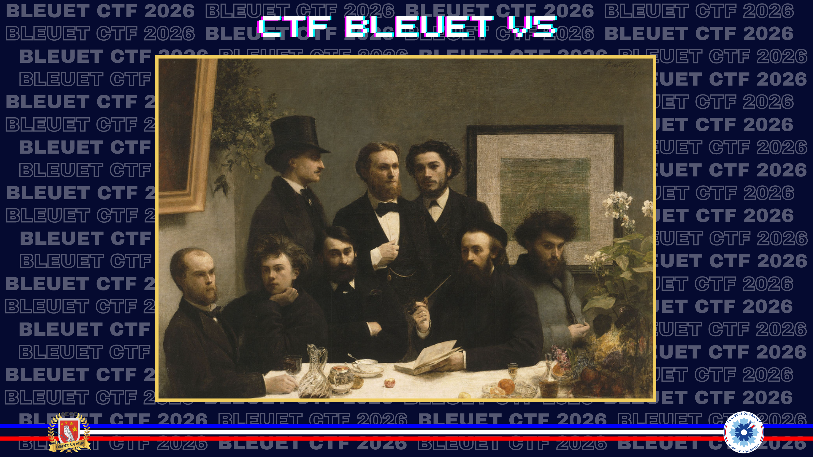
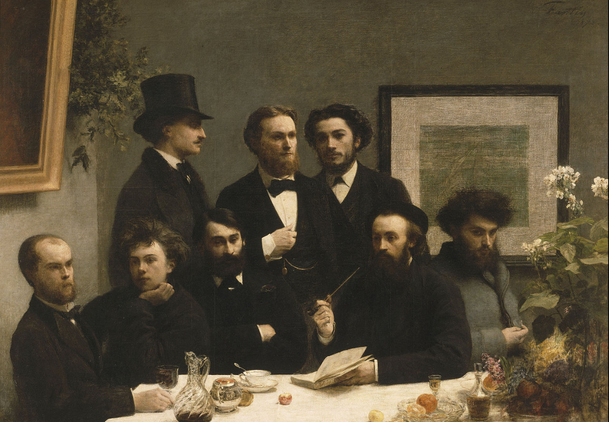

# L’art et la résistance

> « Qu’est-ce que créer, aujourd’hui, dans le monde dans lequel nous vivons ? C’est proposer, de temps à autre, dans un acte de résistance non pas modeste, mais mineur, un signal – un livre, une œuvre d’art – qui émettra une faible lueur vaine et gratuite dans la nuit. » — Jean-Philippe Toussaint

> L’art est un acte de résistance qui était souvent utilisé comme moyen de défier l’oppression et de garder vivante l’espérance. Cette peinture représente d’une certaine manière la libération de l’oppression en Europe. Elle met en avant un artiste qui a profondément marqué la littérature française et qui a annoncé, malgré lui, une opération militaire d’envergure.

Qui est cet individu et de quelle opération s’agit-il ?

**Format du flag** : `marie_leroux_opération`

---

Une recherche d’image inversée permet d’identifier le tableau : **Un coin de table**, peint par **Henri Fantin-Latour** en 1872.

L’homme assis à gauche est **Paul Verlaine**, auteur du poème **Chanson d’Automne**, déjà croisé dans les challenges précédents. Le lien avec la Résistance vient de l’usage du poème comme message codé annonçant le débarquement de Normandie.

Il reste donc à confirmer le nom de code de l’opération.

**Source :** [Wikipedia — Bataille de Normandie](https://fr.wikipedia.org/wiki/Bataille_de_Normandie)

> *La bataille de Normandie correspond à l’opération **Overlord**, selon son nom de code en anglais.*

✅ **Réponse :** `paul_verlaine_overlord`