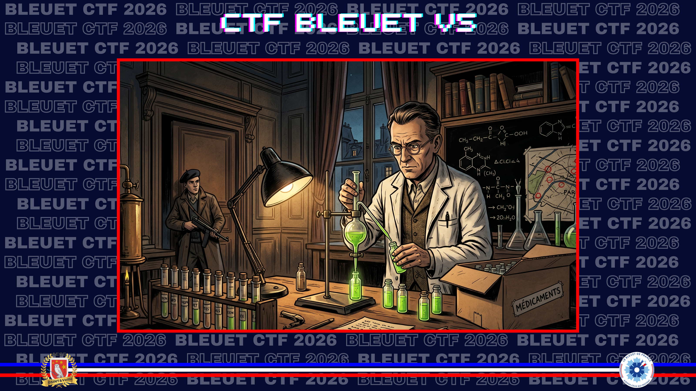

# Alias et acide

> Dans la valise de votre grand-père, vous tombez sur des dizaines de documents, de lettres et d’images. Plusieurs articles papiers que vous avez lu font état de l’arrestation de Maurice Ripoche en 1943. Le mouvement de Résistance « Ceux de la Libération » est alors repris par un homme, chimiste de profession. Il avait compris que pour résister, l'inventivité était primordiale. Son laboratoire, situé à l'Académie de médecine, servait régulièrement de lieu de rendez-vous clandestin et de point de départ pour des actions de sabotage.

Quel était son alias de résistant ? Quelle invention chimique a-t-il mis au point pour saboter les camions allemands ?

**Format du flag** : legrand_plaques_lumineuses

---

Première étape, se renseigner sur le CDLL, et encore une fois il ne sera pas nécessaire de chercher très loin.

[Wikipedia](https://fr.wikipedia.org/wiki/Ceux_de_la_Lib%C3%A9ration)

Au début de 1942, Roger Coquoin (alias **Lenormand**) (1897 - 1943) rencontre Maurice Ripoche [...]
Au printemps 1943, son nouveau chef, **Roger Coquoin** [...]

Roger Coquoin est bien chef du laboratoire de chimie de l'Académie de médecine, et j'ai donc son alias. Il ne reste qu'à se renseigner sur son invention. Le site du Musée de la Résistance s'avère plus complet.

[Musée de la Résistance en ligne](https://museedelaresistanceenligne.org/media2714-Roger-Coquoin)

Sa spécialité professionnelle lui permet aussi de mettre au point, avec Maurice Ripoche et Raymond Jovignot, des détonateurs et des **pastilles abrasives** (du carborandum englobé dans de la paraffine) : ces dernières sont destinées à saboter les moteurs des camions allemands

✅ **Réponse :** `lenormand_pastilles_abrasives`