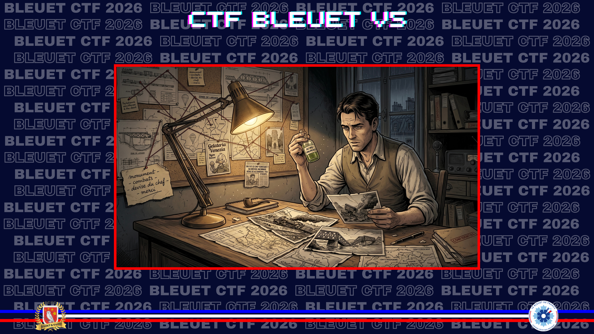
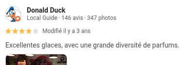
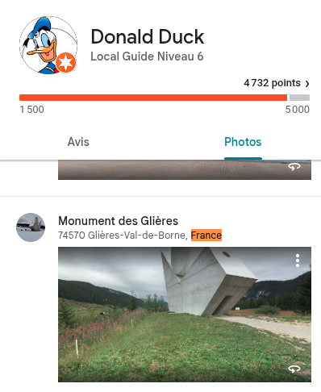

# Le glacier tenace

> Dans la valise, une seule mention griffonnée : « monument - combats - devise du chef - merci ». Votre grand-père n'a pas précisé quel était ce monument. En cherchant, vous tombez sur une piste inattendue : un personnage de Picsou qui apprécie tout particulièrement la « diversité » de parfums de glace de la Gelateria Venezia de Nyon en Suisse. Ce personnage est déjà allé en France, dans ce monument aux morts qui rend hommage aux résistants et l’a pris en photo. Renseignez-vous sur ce lieu de résistance. Qui fut le chef résistant qui s’est particulièrement illustré lors des combats à cet endroit  ?

Trouvez sa devise.

**Format de flag** : Le monde entier ne pourra nous résister 

---

Avec le mot clef "Diversité" apparemment important, je commence à fouiller les avis Google concernant le glacier "Gelateria Venezia" de Nyon. L'un de ceux-ci est signé par "**Donald Duck**" et vante la diversité des parfums. C'est le bon pivot.

[Google Avis](https://share.google/r5zGCTI5rD7KzyXUS)

En suivant son profil, je découvre une personne plutôt prolifique. Je me concentre sur ses avis avec photos, et en France. Un monument à Bordeaux, mais en mémoire de La Terreur. Mauvaise période historique. Puis finalement, le Monument des Glières.

[Google Avis](https://maps.app.goo.gl/EXPfuPUT3KBBkdAJ8)

Il ne reste qu'à approfondir les recherches sur ce lieu, et encore une fois Wikipedia est assez complet sur l'histoire du Maquis des Glières. J'obtient le nom d'un chef, **Tom Morel**, qui s'est effectivement plutôt bien illustré, et je consulte également sa page.

[Wikipedia](https://fr.wikipedia.org/wiki/Maquis_des_Gli%C3%A8res)

Mais la nuit précédente, le chef des Glières, le lieutenant **Tom Morel**, est tué au cours d'une attaque du maquis contre un village tenu par un GMR. En effet, le 9 mars 1944, Tom Morel décide de mener une opération contre le commandement du GMR Aquitaine basé à Entremont au pied du plateau des Glières.

[Wikipedia](https://fr.wikipedia.org/wiki/Tom_Morel)

Tom Morel s'illustre par ses talents de chef et d'entraîneur d'hommes venus d'horizons géographiques, sociaux et politiques très divers. Il adopte la devise « **vivre libre ou mourir** » et instruit son bataillon

✅ **Réponse :** `Vivre libre ou mourir`