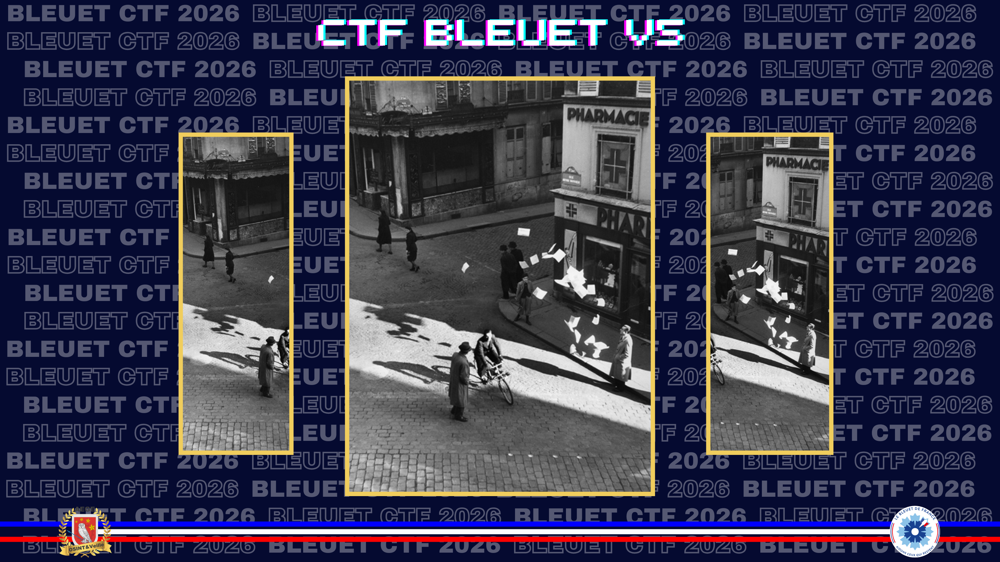
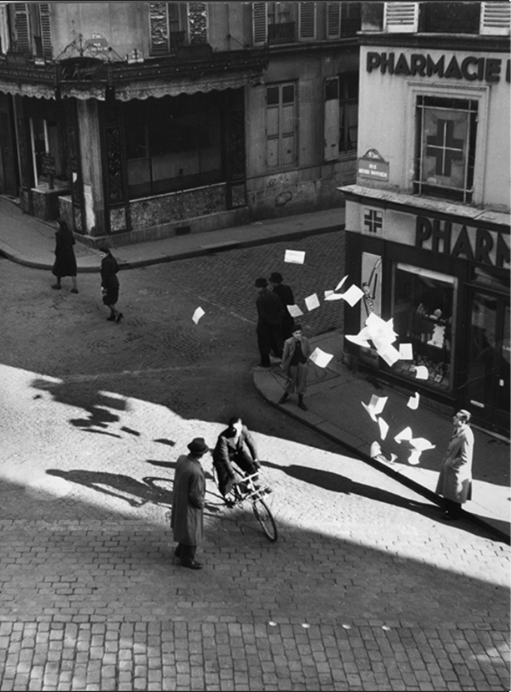
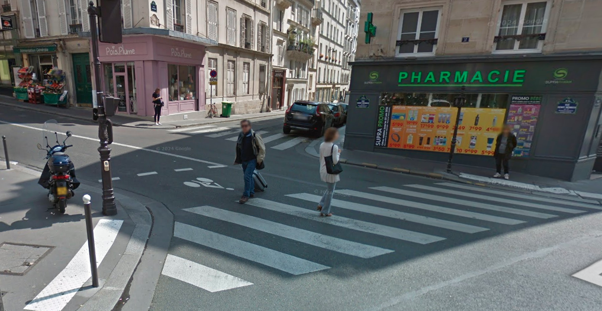
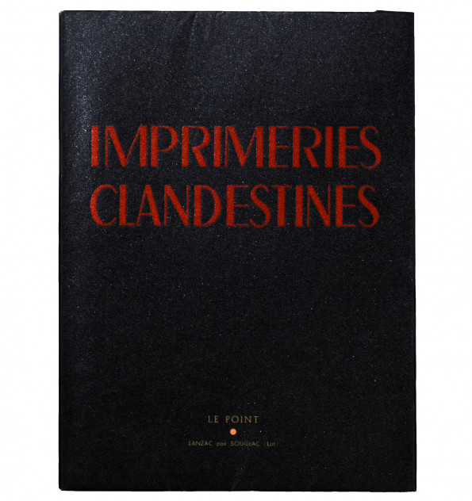
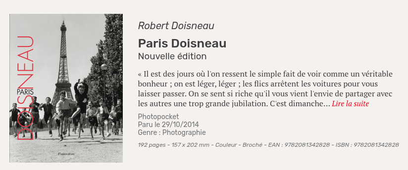

# Le tract dissident

> Une photographie attire votre attention : des cyclistes qui ne font que passer, ou qui distribuent des tracts dans la rue. Votre grand-père avait noté une date en marge : 29 octobre. Cependant, vous ne parvenez pas à confirmer cette date avec vos propres recherches, alors vous décidez de lui faire confiance.

Retrouvez le lieu et l’heure **arrondie à l’entier** à laquelle cette photographie a été prise.

> _Nota bene_ : Les « cyclistes lanceurs de tracts » désignent des résistants qui utilisaient le vélo pour diffuser rapidement des tracts et journaux clandestins, parfois à la volée, tout en se fondant dans la circulation ordinaire.

**Format du flag** : `nom_de_la_rue_heure`  
*Exemple : `rue_jean_jacques_rousseau_23`.*

---

> **Statut : non résolu pendant le CTF.**  
> Notes conservées pour documenter les pistes explorées et le point de blocage.

La recherche d’image inversée permet d’identifier le photographe, **Robert Doisneau**, ainsi que le lieu de la scène : la **rue Henry-Monnier**, à Paris.

**Source :** [Musée de la Résistance nationale à Champigny](https://www.musee-resistance.com/expositions-doisneau-presentation/)

Cycliste lanceur de tracts **rue Henry-Monnier**, automne 1944 - printemps 1945. Collection AAMRN, musée de la Résistance nationale à Champigny-sur-Marne, © Atelier Robert Doisneau.

Une vérification sur Google Maps confirme la cohérence du lieu : l’angle de rue et la pharmacie permettent de reconnaître la scène.

**Source :** [Google Maps](https://maps.app.goo.gl/egxmC66rYQbeEQ8x8)

En approfondissant l’historique de ce cliché, je trouve une information importante : la photographie n’a pas été prise pendant l’Occupation, mais après la Libération de Paris. Elle appartient à une série mise en scène par Doisneau pour documenter la fabrication et la diffusion de la presse clandestine.

**Source :** [Ecoute 2024, n°1, p. 24](https://fr.scribd.com/document/924855841/ecoute-2024-no-01)

Sur la photo, on aperçoit un cycliste lançant des tracts clandestins. L’article précise que l’image est une reconstitution postérieure à la Libération, réalisée au croisement des rues Henry-Monnier et Laferrière.

Cette piste renvoie au reportage **Imprimeries clandestines**, publié dans la revue _Le Point_, n°31, en mars 1945.

**Source :** [Revue Le Point XXXI — Imprimeries clandestines](https://librairiejumentverte.com/fr/archives/2200-revue-le-point-xxxi-imprimeries-clandestines-mars-1945.html)

Le lieu est donc solidement identifié. Le blocage porte sur l’heure de prise de vue : aucune des sources consultées ne donne d’horaire explicite.

Tentatives à partir d’une estimation par les ombres :

⛔ **Fail :** `rue_henry_monnier_11`  
⛔ **Fail :** `rue_henry_monnier_10`

Dernière piste explorée : le lien possible entre Doisneau et la date du 29 octobre. Le rapprochement mène au livre **Paris Doisneau**, publié le 29 octobre 2014, sans permettre de résoudre l’heure demandée.

