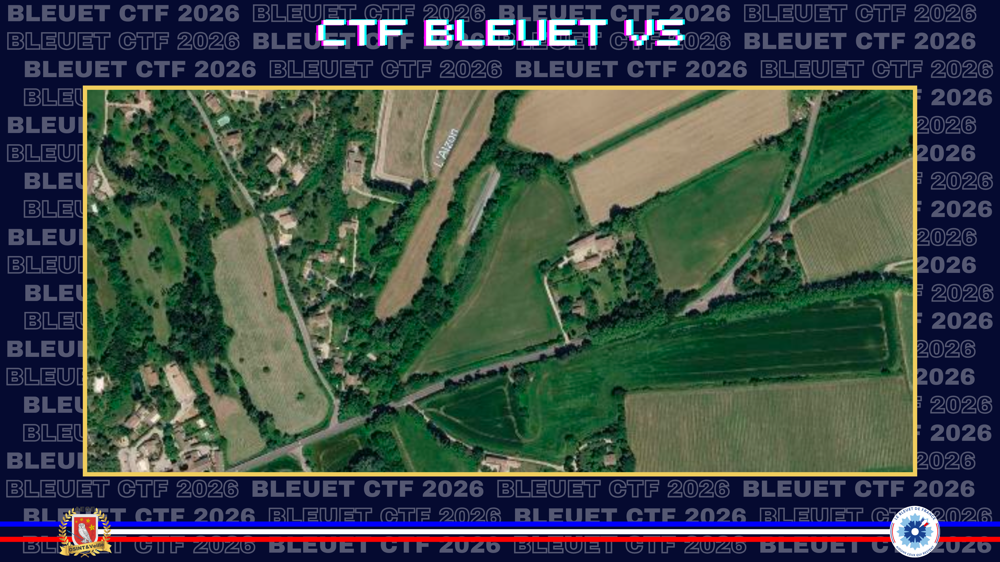
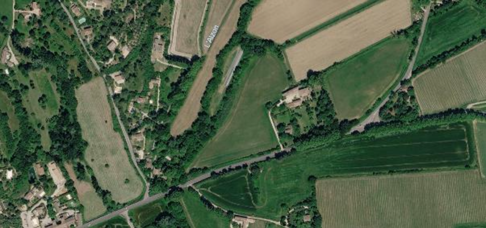
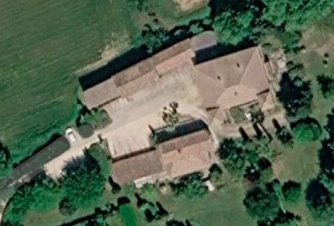
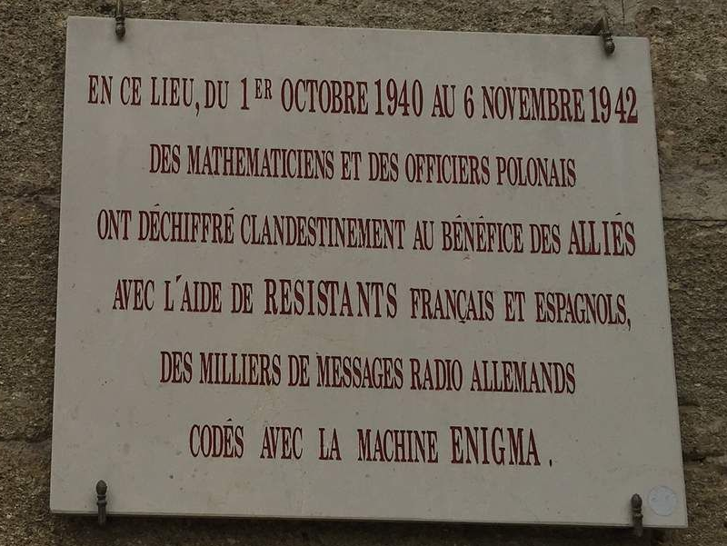

# Le refuge des dechiffreurs

> Été 1940. La France vient de tomber. Un officier français rachète discrètement une propriété et y installe une équipe de cryptanalystes polonais qui, depuis un château de la zone libre, vont continuer à déchiffrer les messages de la Wehrmacht en secret. Ce centre clandestin porte le nom d'une ville portuaire, à l'autre bout d'une ancienne route romaine. Il a fonctionné pendant deux ans, transmettant ses résultats à Londres. Puis il a disparu. Retrouve sa trace.

Une fois que vous avez retrouvé ce château, retrouvez le **nom de code du site d’implantation** de cette cellule de cryptoanalystes qui avait pris place ici. Également, trouvez **qui en était au commandement**.

**Format du flag** : nom_organisation_Pierre_Lambert

**Ressource :**

---

L'image fournie présente le nom de la rivière Alzon, qui s'avère être un affluent du Gard. J'ai donc un bon point de départ, et les champs alentours ayant des formes bien spécifique, en suivant la rivière je tombe rapidement sur l'emplacement via Google Maps : https://maps.app.goo.gl/8rTUGW9ZXke334Zr7 et par extension le château des Fouzes dont la plaque commémorative ne laisse pas de place au doute.

Une petite recherche sur ce château m'envoie vers une page Wikipedia qui donne rapidement les informations recherchées :

[Wikipedia](https://fr.wikipedia.org/wiki/PC_Cadix)

Le **PC Cadix**, poste de commandement Cadix, est le nom de code du site d'implantation d'une **cellule de déchiffrement** franco-polono-espagnols [...]

L'antenne prend le nom de PC Cadix, sans doute en raison de l'ancienne via Domitia, la route impériale de Rome à Cadix [...]

L'équipe basée au **PC Cadix** et dirigé par **Gustave Bertrand** est composé de 7 Républicains espagnols, 15 Français et 15 Polonais.

Cadix est bien une ville portuaire reliée à Rome par une ancienne voie romaine.

✅ **Réponse :** `PC_Cadix_Gustave_Bertrand`
