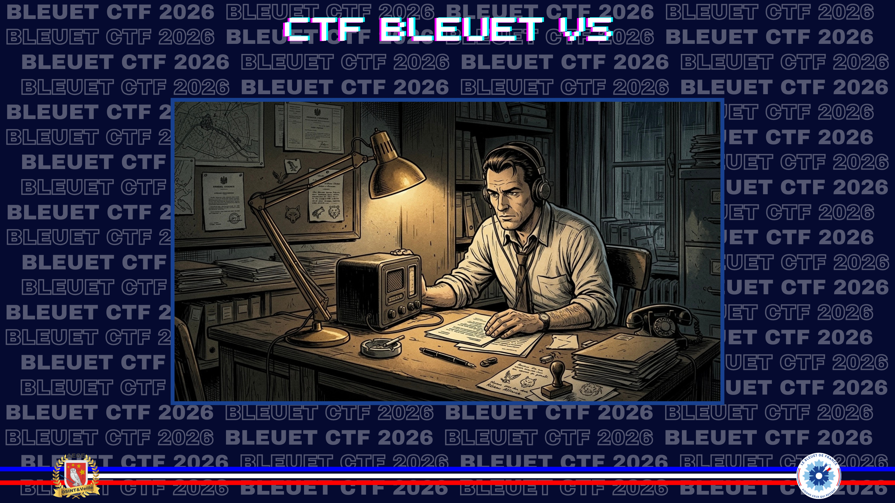

# L'ingenieur de l'ombre

> Ingénieur et officier, Gabriel Romon se retrouve, sous le régime de Vichy, à la tête d’un centre d’écoutes stratégique. En apparence, il met ses compétences au service des autorités en place. En réalité, il détourne les informations qu’il capte pour alimenter la Résistance. Il rejoint le Réseau Alliance, une organisation clandestine particulièrement structurée, dont les membres utilisent des noms d’animaux pour préserver leur anonymat. Ce réseau, redoutablement efficace, attire rapidement l’attention des Allemands, qui lui attribuent un surnom d’inspiration biblique. Démasqué, Romon est arrêté puis fusillé. Mais son parcours a été conservé dans les archives, et il est encore possible d’en suivre les traces aujourd’hui.

Au sein du réseau, chaque agent porte un nom d’animal. Celui de Romon est celui d’un oiseau blanc. Retrouvez-le.

**Format du flag** : poney

---

Rien de très compliqué. J'ai un nom, un prénom. Petite recherche Wikipedia pour trouver la page de cet officier des transmissions. Il y est précisé dans les premières lignes son pseudonyme :

[Wikipedia](https://fr.wikipedia.org/wiki/Gabriel_Romon)

Romon fait partie d'un certain nombre de réseaux de résistance [...] comme conseiller technique pour le secteur radio (sous le pseudonyme « **Cygne** »).

✅ **Réponse :** `cygne`