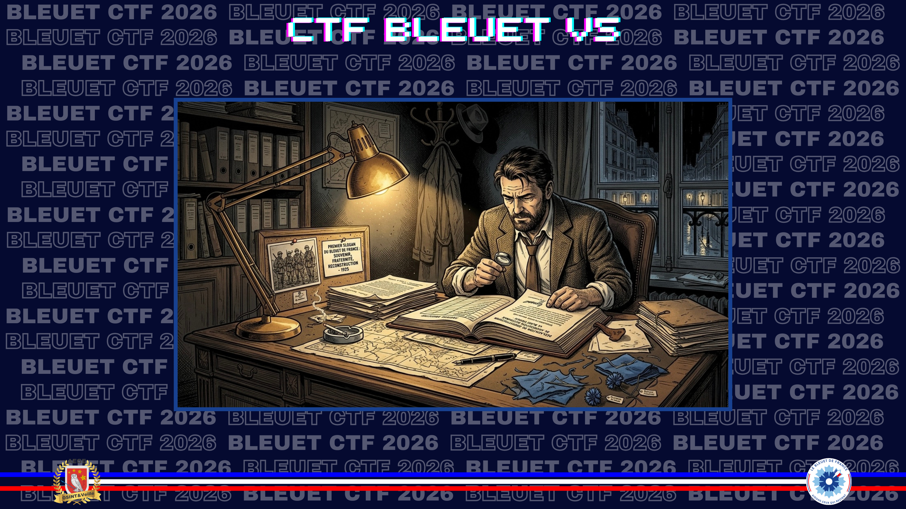
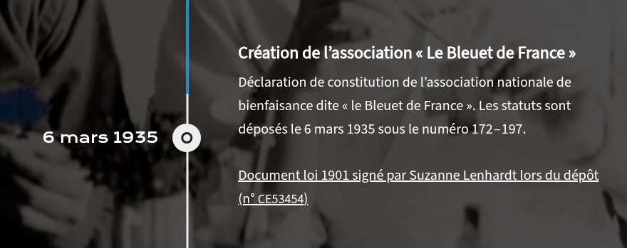
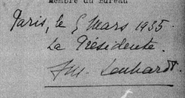

# L’éclosion du souvenir

> Cette fleur pousse dans la boue des champs de bataille. Les soldats la remarquent, elle résiste quand tout est détruit. En 1925, deux femmes décident d'en faire un symbole concret : une petite fleur en tissu, un bleuet confectionné par des mutilés de guerre dans un atelier parisien, vendu dans la rue pour constituer leur maigre revenu. L'idée traverse un siècle. Mais tout a commencé quelque part, à une date précise. Retrouvez les origines.

Après avoir retrouvé le **premier slogan que l’on pouvait voir sur le site du Bleuet de France**, enquêtez sur les deux personnes à l’origine de ce mouvement. L’une d’entre elles a signé la déclaration de constitution de l’association nationale de bienfaisance dite « le Bleuet de France ». **Quel est son nom ?**

**Format du flag** : `et_un_pour_tous_et_tous_pour_un_Marie_Martine`

---

Je commence par la page historique du site du Bleuet de France.

**Source :** [Bleuet de France — Une fleur dans la guerre](https://www.bleuetdefrance.fr/notre-histoire/une-fleur-dans-la-guerre-1916-1938/)

> *À l’origine de cette initiative, deux femmes : **Suzanne Lenhardt**, infirmière à l’Institution nationale des Invalides, et **Charlotte Malleterre**, fille du Général Niox et épouse du Général Malleterre.*

Plus bas sur cette page, la ligne du temps renvoie au document officiel de constitution de l’association, daté du 6 mars 1935.

Le document confirme la signature recherchée.

Il reste à retrouver le premier slogan visible sur le site du Bleuet de France. La Wayback Machine permet de consulter une archive de 2008.

**Source :** [Wayback Machine — bleuetdefrance.fr, 2008](https://web.archive.org/web/20081105114857/http://www.bleuetdefrance.fr/)

✅ **Réponse :** `la_memoire_se_transmet_l_espoir_se_donne_Suzanne_Lenhardt`
