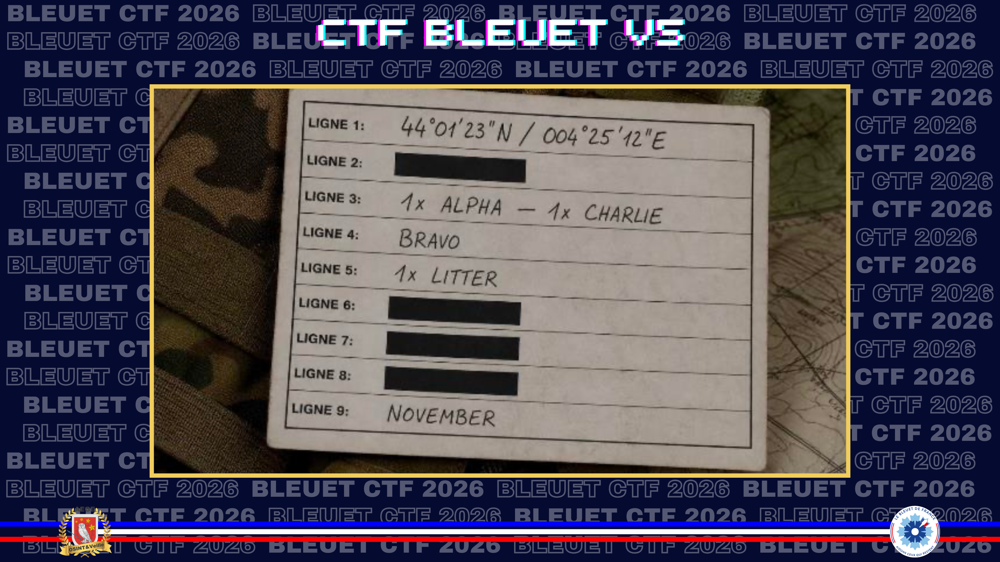
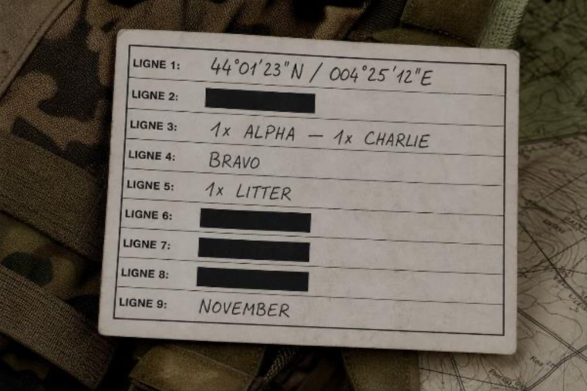
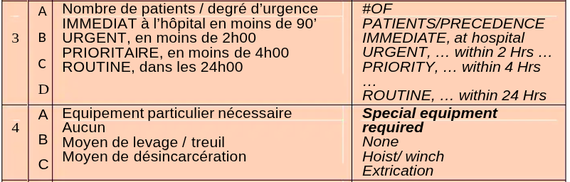

# MEDEVAC NEEDED

> Zone de combat. Un soldat est à terre. Son équipier saisit la radio. Il a 30 secondes pour transmettre 9 lignes d'information qui permettront d'envoyer un hélicoptère. Pas une de plus, pas une de moins, c'est la procédure OTAN. C'est de cette procédure que tire son nom l'association **Nine Line** : née de la reconstruction d'un soldat blessé, elle soutient aujourd'hui militaires, pompiers et forces de l'ordre qui souffrent en silence.

Voici un Nine Line intercepté. **Décodez-le des lignes 3 à 4**.

**Format du flag**: soleil_pluie_moto (_pas de chiffres, pas d'accents_)

**Ressource :**

Plusieurs sources en ligne permettent de traduire les différentes lignes du protocole "9-Line MEDEVAC", avec quelques variations observées cependant, la ligne 3 allant d'Alpha à Charlie sur certaines sources, et jusqu'à Delta sur d'autres. Je prends le parti de suivre un manuel d'infanterie : 

> [!9-Line] [Manuel d'Emploi de La Section d'Infanterie (page 45)](https://www.scribd.com/document/1026226737/At-04-01-FEB17-Manuel-d-Emploi-de-La-Section-d-Infanterie)
> 

✅ **Réponse :** `urgent_prioritaire_treuil`